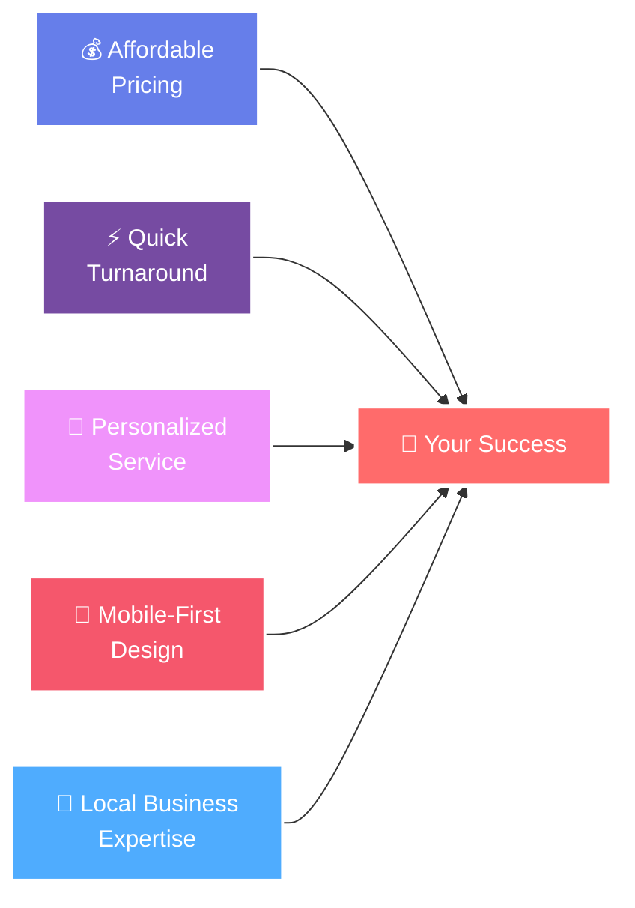
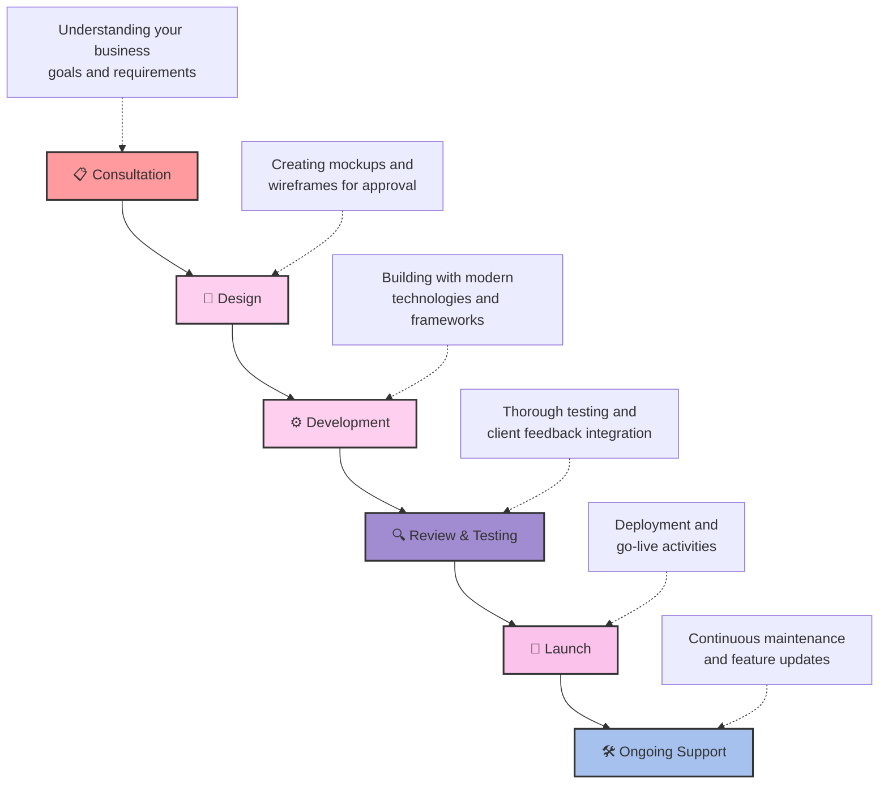

# 🚀 Digi Crafters

  
  
  **🌟 Your Business, Your Website, Your Online Presence 🌟**
  
  *Your premier partner for creating stunning, affordable, and professional websites tailored to small businesses. We specialize in crafting digital experiences that help local businesses thrive in the online world.*

---

## 🎯 Who We Serve

We proudly work with a diverse range of small businesses:

| 🏋️ **Fitness** | 🧁 **Food & Beverage** | 🛍️ **Retail** | 🏨 **Hospitality** | 💅 **Beauty & Wellness** |
|:---:|:---:|:---:|:---:|:---:|
| Gyms & Fitness Centers | Bakeries & Cafés | Retail Stores | Hotels & Resorts | Beauty Salons & Spas |
| Personal Trainers | Coffee Shops | Boutique Shops | Vacation Rentals | Wellness Centers |
| Yoga Studios | Restaurants | Local Bookstores | B&Bs | Massage Therapy | Other Business

---

## 💼 Our Services

<table>
<tr>
<td width="50%">

### 🌐 **Web Development**
- ✅ Custom responsive websites
- ✅ Modern design frameworks
- ✅ Cross-platform compatibility
- ✅ Performance optimized

### 🛒 **E-commerce Solutions** 
- ✅ Secure payment processing
- ✅ Inventory management
- ✅ Customer portal
- ✅ Order tracking system

### 🔍 **SEO Optimization**
- ✅ Search engine visibility
- ✅ Local SEO strategies
- ✅ Content optimization
- ✅ Analytics integration

</td>
<td width="50%">

### 📝 **Content Management**
- ✅ Easy-to-update CMS
- ✅ Training & documentation
- ✅ Multi-user access
- ✅ Content scheduling

### 🎨 **Brand Identity**
- ✅ Logo design & branding
- ✅ Brand consistency
- ✅ Visual identity guidelines
- ✅ Marketing materials

### 🔧 **Maintenance & Support**
- ✅ 24/7 technical support
- ✅ Regular updates
- ✅ Security monitoring
- ✅ Performance optimization

</td>
</tr>
</table>

---

## 💎 Why Choose Digi Crafters?

<b>🔍 Click to see our competitive advantages</b>

### 💰 **Affordable Pricing**
- Transparent pricing with no hidden fees
- Flexible payment plans available
- ROI-focused solutions

### ⚡ **Quick Turnaround**
- 1-4 weeks average delivery time
- Agile development process
- Regular progress updates

### 👥 **Personalized Service**
- Dedicated project manager
- Direct communication channels
- Custom solutions tailored to your needs

### 📱 **Mobile-First Design**
- 100% responsive designs
- Touch-optimized interfaces
- Cross-device compatibility

### 🏪 **Local Business Expertise**
- Understanding of local markets
- Industry-specific solutions
- Community-focused approach

---

## 🚀 Our Development Process

---

## 🛠️ Technologies We Use

### Frontend Technologies

### Backend & Database

### Tools & Deployment

---

## 📞 Get Started Today

### 🌐 **Visit Our Website**

---

## 📋 Project Checklist

- [x] **Discovery Phase** - Understanding your business needs
- [x] **Design Phase** - Creating visual mockups and prototypes  
- [x] **Development Phase** - Building your website with modern technologies
- [x] **Testing Phase** - Ensuring quality and performance
- [x] **Launch Phase** - Going live with your new website
- [x] **Support Phase** - Ongoing maintenance and updates

---

### **Let us help you craft your digital presence today!**

*© 2025 Digi Crafters. All rights reserved.*

---

